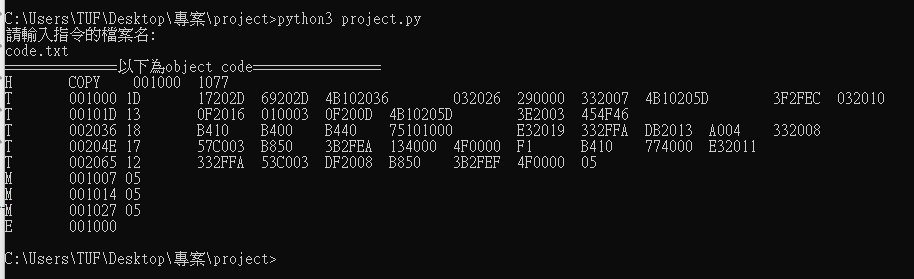

# REPORT

> 40771107H 資工四 簡郁宸


1. **The  architecture  of  the  implemented  assembler**

   建立op code table，還有register table。

   pass 1:

   先建立SYMBOL table。

   pass 2:

   根據不同的op code處理n,i,x,b,p,e，並且計算特定opcode需要的SYMBOL和PC 的distance，並以list的方式儲存每行code的instruction Location和object code。最後再將object program打印出來。

   

2. How to execute your program

   + 要轉換的 assemble code 要和 project.py 同個目錄下，並且 assemble code 請以 tab 的方式隔開呈現
   + 執行以下指令

   ```
   $ python3 project.py
   ```

   

3. **What  you  have  learned  and  experienced  during  the  implementation. E.g.  You  could  show  your  daily  record  of  the  implementation.** 

   + 知道為何要2 Pass的用意，以及如何建立TABLE。 
   + 知道format 1~4之間的差別，以及n,i,x,b,p,e之間的關係。
   + linux的system call呼叫，pipe、signal的實作，以及PCB的運作模式。

4. **In  case  you  implement  more  than  the  required  specification,  please itemize  it.** If  you  implement  something  mentioned  in  the  previous  slice  (bonus points),  show  your  test  codes  (in  SIC/XE),  and  the  generated  object programs. 

   沒有多做特殊功能。
